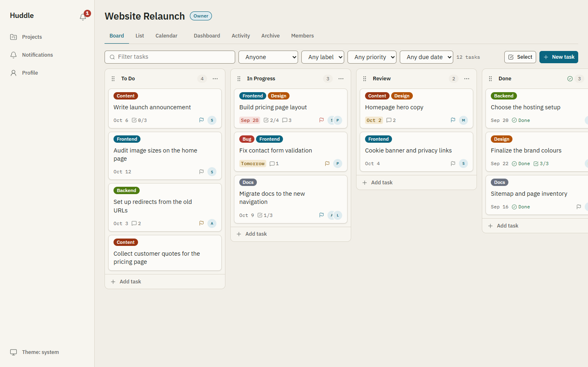
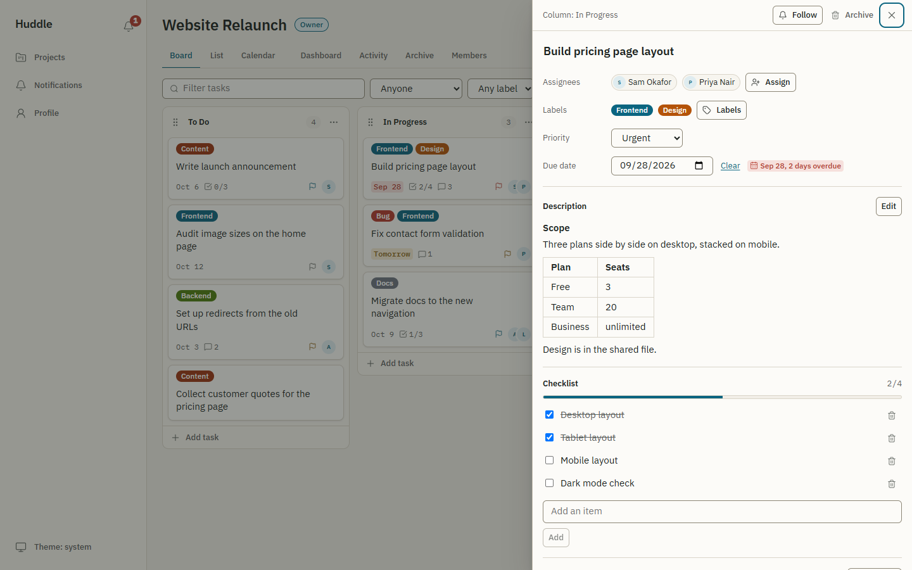
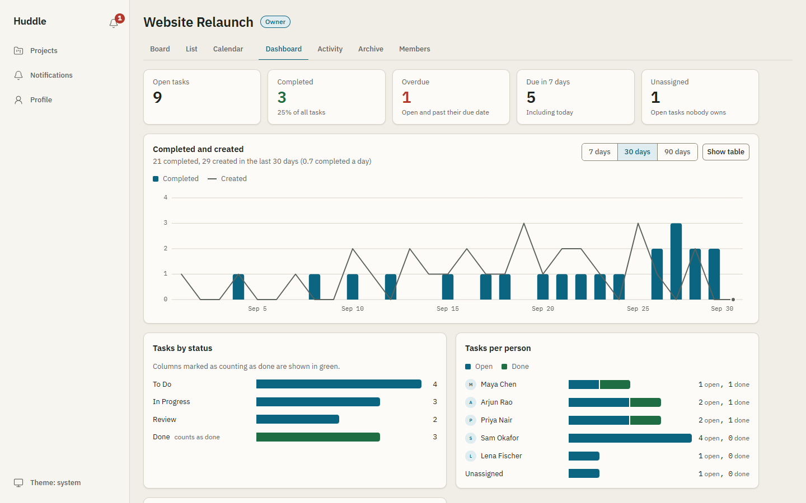
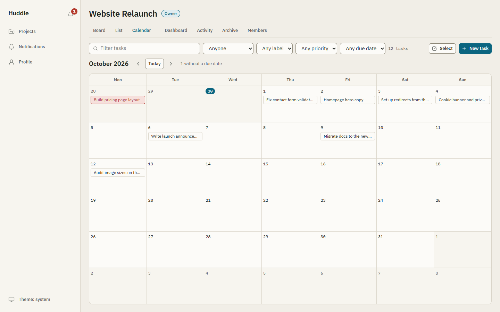
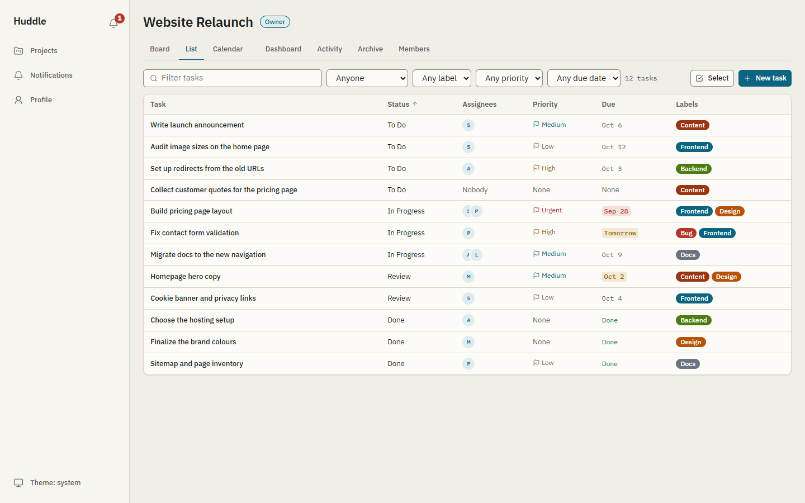
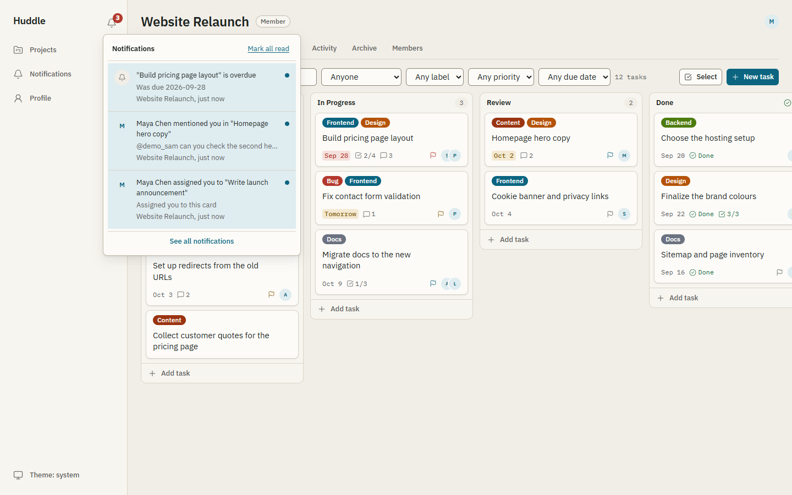
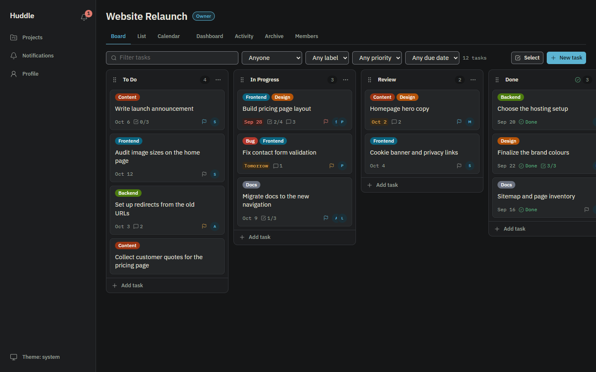
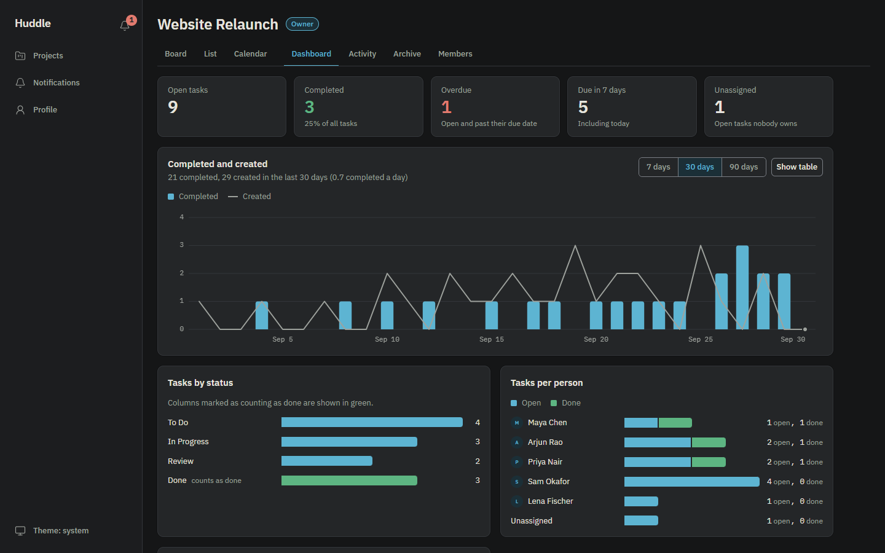
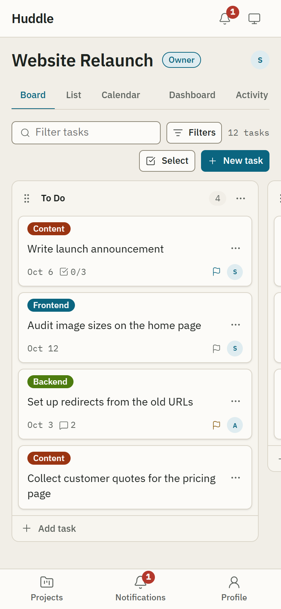

# Huddle

> A collaborative project management tool built with the MERN stack.

Huddle is a shared board for small teams: custom columns, task cards with assignees, labels, priorities, due dates, checklists, files and threaded comments, live updates for everyone who has the board open, and a dashboard that shows where the project stands. It has a board, list and calendar view, roles that are enforced on the server, light and dark themes, and works on a phone as well as a computer.

---


---

## Live Demo

> [Huddle Project Management Tool](https://codealpha-huddle.vercel.app/).

Try it locally with the demo accounts (after `npm run seed`, see below). Every demo account uses the password `huddle-demo-1234`.

| Account | Role |
|---|---|
| `demo_maya@huddle.demo` | Owner of Website Relaunch, member of Mobile App Beta, has a pending invitation |
| `demo_arjun@huddle.demo` | Admin in Website Relaunch, owner of Mobile App Beta |
| `demo_priya@huddle.demo` | Member in Website Relaunch, owner of Hiring 2026 |
| `demo_sam@huddle.demo` | Member in Website Relaunch, viewer in Mobile App Beta |
| `demo_lena@huddle.demo` | Viewer in Website Relaunch, admin in Hiring 2026 |

---

## Features

- Register, log in, profile with name and photo; JWT sent in an `Authorization` header, bcrypt password hashing, sessions that end when the password changes
- Projects with four roles (owner, admin, member, viewer), checked on the server for every request
- Invitations by username, by email address (sent through Gmail SMTP), or with a shareable link that can be revoked
- Boards with custom columns (add, rename, reorder, delete), drag and drop with @dnd-kit, and a Move to menu for touch screens
- Cards with a markdown description, assignees, user-defined labels, priority, due date, checklist with progress, file attachments (Cloudinary, direct upload) and threaded comments with @mentions
- Live updates through Ably: cards, comments, roles and members change on every open screen, with presence avatars showing who else is on the board
- Notifications (assigned, mentioned, replied to, comment on a followed card, due soon, overdue, invited) with a bell, a full page and watchers per card
- Board, List (sortable) and Calendar views with shared filters that live in the URL
- Search across projects, command palette (Ctrl or Cmd + K) and keyboard shortcuts
- Archive and restore for tasks, columns and projects (nothing is hard deleted), duplicate task, bulk select with Undo
- Activity log filterable by kind, person and task
- Project dashboard: open, completed and overdue counts, tasks per column and per person, and a chart of tasks created and completed per day
- Public site with a header menu (Home, Features, About, Contact), a landing page, an About page, a contact form that emails the owner, Terms of Service and Privacy Policy
- Light and dark themes designed separately, fully responsive (375, 768 and 1280 px and up), keyboard accessible

---

## Screenshots

| Board | Card | Dashboard |
|---|---|---|
|  |  |  |

| Calendar | List | Notifications |
|---|---|---|
|  |  |  |

| Dark mode | Dark dashboard | Phone |
|---|---|---|
|  |  |  |

The screenshots are taken from the running app with `tools/capture-screenshots.cjs`.

---

## Tech Stack

**Frontend**
- React 19 + React Router v7
- Vite (build tooling)
- Vanilla CSS with design tokens for light and dark themes (no hard coded colours in components)
- IBM Plex Sans and IBM Plex Mono, lucide-react icons through one wrapper
- @dnd-kit for drag and drop, react-markdown for descriptions and comments
- Hand built SVG charts

**Backend**
- Node.js + Express 5
- MongoDB Atlas + Mongoose
- JWT authentication (jsonwebtoken + bcryptjs)
- Ably (REST publish from the API, token authentication for browsers)
- Cloudinary (signed direct uploads), Nodemailer (Gmail SMTP for invitation emails)
- Helmet and express-rate-limit

**Hosting**
- Vercel, as two projects (client and API)

### About storing the token in the browser

The JWT is kept in the browser's local storage and sent in the `Authorization` header. This means a script injected into the page (XSS) could read it, which is the trade-off against cookies. It is reduced by a strict Content Security Policy (no inline scripts), React escaping all output, markdown that never renders raw HTML, and short token lifetimes. The Privacy Policy says the same in plain words.

---

## Project Structure

```
CodeAlpha_Huddle/
├── client/                  # React frontend (Vite)
│   ├── public/screens/      # Landing page screenshots (WebP, light and dark)
│   └── src/
│       ├── components/      # Shell, dialogs, menus, palette, notification bell
│       ├── lib/             # API client, auth, realtime, board and card state
│       ├── pages/           # One folder or file per screen
│       │   ├── board/       # Board, List, Calendar, card panel, filters, bulk bar
│       │   ├── dashboard/   # Dashboard and its charts
│       │   └── landing/     # Landing page, About, Contact, Terms, Privacy
│       └── styles/          # tokens.css, base.css, shell.css, ui.css
├── server/                  # Express API
│   ├── api/                 # Vercel serverless entry
│   ├── scripts/             # Seed data, mail test
│   └── src/
│       ├── config/          # Cached Mongo connection
│       ├── models/          # User, Project, Column, Card, Comment, Label, Invite, Notification, Activity
│       ├── controllers/
│       ├── middleware/      # Auth, project roles
│       ├── routes/
│       ├── services/        # Realtime, notifications, activity, mail
│       └── utils/
├── screenshots/             # README screenshots
├── tools/                   # Screenshot capture script
├── API.md                   # API reference
└── PROGRESS.md              # Build log, phase by phase
```

---

## Running Locally

**Prerequisites:** Node.js 20+, a MongoDB Atlas URI, a Cloudinary account and an Ably account (free tiers, no card). `ABLY_API_KEY` is server-only and is never sent to the browser.

**Backend**

```bash
cd server
cp .env.example .env     # fill in MONGODB_URI (with /huddle_db), JWT_SECRET, CLIENT_URL, Cloudinary and Ably keys
npm install
npm run dev              # http://localhost:5000
```

- `JWT_SECRET` must be a random string of 32 or more characters.
- `MONGODB_URI` must name the database (`.../huddle_db?...`), otherwise the API refuses to start.

**Invitation emails (optional)**

Inviting an email address that has no account sends that person an email with a join link. It uses a Gmail account and needs no paid service:

1. Turn on 2-step verification for the Gmail account, then create an app password at https://myaccount.google.com/apppasswords.
2. In `server/.env` set `SMTP_USER` (the Gmail address) and `SMTP_PASS` (the app password). `SMTP_FROM_NAME` and `APP_URL` are optional.
3. Check it with `npm run mail:test -- you@example.com`.

The same account also delivers messages from the public contact form to `CONTACT_TO` (default `xyroxx02@gmail.com`). Without these settings the rest of the app works the same, inviting an unknown address explains that email invitations are not set up, and the contact page shows the email address only.

**Frontend**

```bash
cd client
npm install
npm run dev              # http://localhost:5173
```

The dev server forwards `/api` requests to port 5000 (set `API_PORT` to use another port), so keep both running.

**Demo data**

```bash
cd server
npm run seed             # five accounts, three projects with tasks, comments and history
npm run seed:remove      # removes them again
```

Do not run the seed against a database with real data you care about. It only touches accounts whose username starts with `demo_`.

**Screenshots**

```bash
npm i --no-save puppeteer-core
node tools/capture-screenshots.cjs     # needs the app and the seed running
```

API reference: [API.md](API.md).
